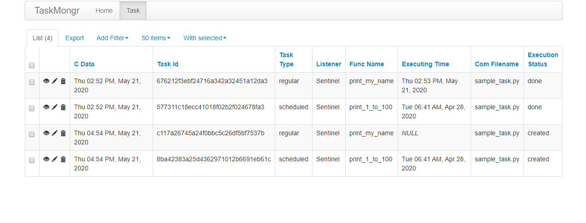

## Intro

`TaskMongr` is another task scheduling library for simple use. 

### Why I Created One, When We Already Have Plenty
I know there are already good to awesome libraries to support do-able to production ready challenges.
To name a few of them `RQ`, `Celery` etc are the most notable for their huge eco systems and support.

There are some motivations, which led to try this one,
- I want to write a simple `task manager` from scratch. 
- It should be simple to run on Windows Machine ( Without WSL Support).
- I have a crazy fascination understanding the inner maechanics of these 
    great libraries by mimicing them from scratch. 
- I Love Creating things. 

### How To Install `taskmongr`
-------------------------------
#### 1. Using Pip
```python
pip install git+https://github.com/sabbiramin113008/taskmongr.git

```
## Setting Up `taskmongr`

#### 1. Setting Up the Database
All the tasks are pickled and saved to a SQLite database for future actions. So after
installing `taskmongr` open up the terminal and type, 
```shell
taskmongr init
```
This will set up a database in the `current user profile directory` as base (for example `C:\Users\<current_user>\taskmongr_home` in my case). But if you set `taskmongr_home` to
any directory of your choices, it will set the database there. This command is required only once after 
a clean installation. 

NB. Keep it default for simple testing.

#### 2. Starting the Listener.
Listener always listens to the tasks enlisted in the database. So before enlisting any task, make
sure you open up the terminal and run the 
```shell
taskmongr listen
```

NB. In future I will adding different Listener support. Currently, and by default it has only one named `Sentinel`.

#### 3. Starting the Server.
You can see the progress of the tasks directly from the server. But to monitor it, you need to
start it. Open up the terminal and hit
```shell
taskmongr serve
```
It will start the Simple Light Weight Web server. Navigate to `http://localhost:4000/` to see
it for yourself. 




### Components
------------------------

### Tasks
`taskmongr` uses decorators to annotate different types of tasks.  
 There are two types of tasks, currently supported by `taskmongr`
 1. `Task`
 2. `ScheduledTask`
 
#### Task
 When a regular task is required, this `@Task()` is used. 
 By default the task will be executed later by the global executor in First in First Out Way. 
 But if `execute='now'` is provided, it will be executed, instantly. 
 
```python
from taskmongr import Task


@Task()
def print_my_name():
    import os
    print(os.name)
```
Here `print_my_name` is annotated as `Task` that will be later executed by the executor.
After invoking the task, a response will be return as
```json
{"flag": 1, "task_id": "577311c18ecc41018f02b2f024678fa3"}
```

### Scheduled Task
When a task is to scheduled, the `@ScheduledTask()` decorator is used. The `at` param
 will take a python `datatime` object to set the schedule simply. Here, 
 
```python
from datetime import datetime

from taskmongr import ScheduledTask
@ScheduledTask(at=datetime(2020, 10, 28, 6, 41))
def print_1_to_100():
    for i in range(1, 101):
        print(i)
```
`print_1_to_100` method is scheduled to execute at 6:41 AM of 28th October, 2020. 
Like the previous one, After invoking the task, a response will be return as
```json
{"flag": 1, "task_id": "676212f3ebf24716a342a32451a12da3"}
```
It will denote if the data is stored or not. 

